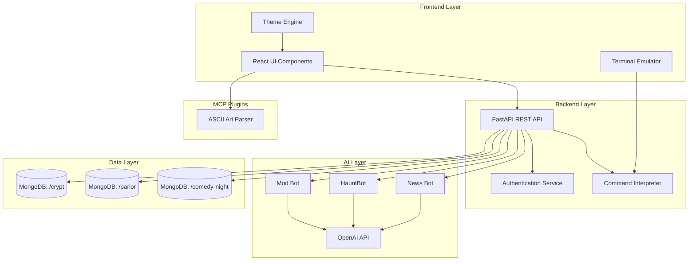

# Neo-BBS Forum Design Document

## Overview

Neo-BBS is a full-stack web application that recreates the classic BBS experience with modern technologies and AI-powered features. The system consists of a React-based frontend delivering retro terminal aesthetics, a Python FastAPI backend handling business logic and AI integration, and MongoDB for thematic data storage. The architecture emphasizes modularity, allowing independent board theming and AI bot operations.

## Architecture

### High-Level Architecture



### Technology Stack

**Frontend:**
- React 18+ with functional components and hooks
- CSS-in-JS (styled-components) for dynamic theming
- Custom terminal emulator component with blinking cursor
- Web fonts: Creepster, Nosifer, Press Start 2P, Silkscreen
- CRT shader effects using CSS filters and animations

**Backend:**
- Python 3.11+
- FastAPI for REST API with automatic OpenAPI documentation
- Pydantic for data validation
- JWT-based authentication
- APScheduler for scheduled tasks (daily news generation)
- OpenAI Python SDK for AI bot integration

**Database:**
- MongoDB Atlas with 3 separate clusters
- Mongoose-style schema validation using Pydantic
- TTL indexes for automatic data lifecycle management

**AI Integration:**
- OpenAI GPT-4 API for content generation
- Custom prompt engineering for each bot personality
- Rate limiting and token management

## Components and Interfaces

### Frontend Components

#### 1. Terminal Container
```typescript
interface TerminalProps {
  board: string;
  theme: ThemeConfig;
}

// Renders the main terminal window with CRT effects
// Manages command input and output display
// Handles theme switching based on board context
```

#### 2. Board View
```typescript
interface BoardViewProps {
  boardId: string;
  threads: Thread[];
  onThreadSelect: (threadId: string) => void;
}

// Displays thread list for a specific board
// Applies board-specific theming and ASCII borders
// Handles pagination and sorting
```

#### 3. Thread View
```typescript
interface ThreadViewProps {
  thread: Thread;
  posts: Post[];
  onReply: (content: string) => void;
}

// Renders thread with all replies
// Displays timestamps and user info
// Provides reply interface for authenticated users
```

#### 4. Command Input
```typescript
interface CommandInputProps {
  onCommand: (command: string, args: string[]) => void;
  history: string[];
}

// Handles command-line style input
// Maintains command history
// Provides autocomplete suggestions
```

#### 5. Theme Engine
```typescript
interface ThemeConfig {
  boardId: string;
  primaryFont: string;
  accentFont: string;
  backgroundColor: string;
  textColor: string;
  borderStyle: string;
  asciiArt: string;
}

// Manages theme switching between boards
// Applies CSS variables dynamically
// Loads board-specific ASCII art headers
```

### Backend API Endpoints

#### Authentication
```python
POST /api/auth/register
POST /api/auth/login
POST /api/auth/logout
GET /api/auth/me
```

#### Boards
```python
GET /api/boards
GET /api/boards/{board_id}
GET /api/boards/{board_id}/threads
```

#### Threads
```python
GET /api/threads/{thread_id}
POST /api/threads
PUT /api/threads/{thread_id}
DELETE /api/threads/{thread_id}
POST /api/threads/{thread_id}/lock
```

#### Posts
```python
GET /api/threads/{thread_id}/posts
POST /api/threads/{thread_id}/posts
PUT /api/posts/{post_id}
DELETE /api/posts/{post_id}
```

#### Commands
```python
POST /api/commands/execute
# Handles: /post, /read, /news, /who, /back, /ascii
```

#### Admin
```python
GET /api/admin/users
POST /api/admin/ghost-mode
GET /api/admin/mod-logs
```

### AI Bot Services

#### News Bot Service
```python
class NewsBotService:
    async def generate_daily_bulletin(self) -> str:
        # Fetch thread activity from last 24 hours
        # Analyze engagement metrics
        # Generate summary using GPT-4
        # Format with thematic styling
        # Post to /news board
        
    async def _build_prompt(self, activity_data: dict) -> str:
        # Construct prompt with context and personality
```

#### HauntBot Service
```python
class HauntBotService:
    async def check_inactive_threads(self) -> List[Thread]:
        # Query threads with no activity for 72+ hours
        # Filter already-resurrected threads
        
    async def resurrect_thread(self, thread: Thread) -> Post:
        # Generate contextual revival message
        # Include thread context in prompt
        # Post reply with haunted theming
```

#### Mod Bot Service
```python
class ModBotService:
    async def analyze_post(self, post: Post) -> ModerationResult:
        # Check for spam indicators
        # Detect repeated content
        # Flag excessive links
        # Return action recommendation
        
    async def take_action(self, user_id: str, violation: str):
        # Issue warning or lock account
        # Log moderation action
```

### MCP Plugin: ASCII Art Parser

```python
class ASCIIArtParser:
    def convert_image(self, image_bytes: bytes, width: int = 80, height: int = 40) -> str:
        # Resize image to target dimensions
        # Convert to grayscale
        # Map pixel brightness to ASCII characters
        # Return formatted ASCII string
        
    def validate_image(self, image_bytes: bytes) -> bool:
        # Check file format (JPEG, PNG, GIF)
        # Validate file size limits
```

## Data Models

### User Model
```python
class User(BaseModel):
    id: str
    username: str
    email: str
    password_hash: str
    role: str  # "user", "admin"
    created_at: datetime
    is_locked: bool = False
    lock_expires_at: Optional[datetime] = None
    spam_warnings: int = 0
```

### Board Model
```python
class Board(BaseModel):
    id: str
    name: str  # "crypt", "parlor", "comedy-night"
    display_name: str
    theme_config: ThemeConfig
    description: str
    cluster_name: str  # MongoDB cluster identifier
```

### Thread Model
```python
class Thread(BaseModel):
    id: str
    board_id: str
    author_id: str
    title: str
    created_at: datetime
    updated_at: datetime
    is_locked: bool = False
    is_pinned: bool = False
    is_resurrected: bool = False
    post_count: int
```

### Post Model
```python
class Post(BaseModel):
    id: str
    thread_id: str
    author_id: str
    content: str
    created_at: datetime
    is_bot: bool = False
    bot_type: Optional[str] = None  # "news", "haunt", "mod"
    ascii_art: Optional[str] = None
```

### ModerationLog Model
```python
class ModerationLog(BaseModel):
    id: str
    user_id: str
    action: str  # "warning", "lock", "delete"
    reason: str
    performed_by: str  # "mod_bot" or admin user_id
    timestamp: datetime
    post_id: Optional[str] = None
```

## Error Handling

### Frontend Error Handling
- Network errors: Display retro "CONNECTION LOST" message with retry option
- Authentication errors: Redirect to login with terminal-style prompt
- Command errors: Show "INVALID COMMAND" with help text
- Rate limiting: Display "SYSTEM OVERLOAD" with cooldown timer

### Backend Error Handling
```python
class BBSException(Exception):
    def __init__(self, message: str, code: str, status_code: int):
        self.message = message
        self.code = code
        self.status_code = status_code

# Custom exceptions
class AuthenticationError(BBSException)
class AuthorizationError(BBSException)
class ValidationError(BBSException)
class RateLimitError(BBSException)
class AIServiceError(BBSException)
```

### Error Response Format
```json
{
  "error": {
    "code": "THREAD_NOT_FOUND",
    "message": "The requested thread has been lost to the void",
    "details": {}
  }
}
```

### AI Service Fallbacks
- OpenAI API failures: Log error, skip bot action, retry with exponential backoff
- Token limit exceeded: Truncate context, regenerate with shorter prompt
- Rate limiting: Queue bot actions for later execution
- Content policy violations: Use fallback templates for bot messages

## Testing Strategy

### Unit Testing
- **Frontend**: Jest + React Testing Library for component testing
- **Backend**: pytest for API endpoints, services, and utilities
- **AI Bots**: Mock OpenAI responses for deterministic testing
- **Database**: Use in-memory MongoDB for isolated tests

### Integration Testing
- API endpoint flows (register → login → post → reply)
- AI bot trigger conditions and actions
- Command interpreter with various input patterns
- Theme switching and rendering

### End-to-End Testing
- Playwright for browser automation
- Test critical user journeys:
  - Anonymous browsing
  - User registration and posting
  - Thread resurrection by HauntBot
  - Admin moderation actions

### Performance Testing
- Load testing with Locust for concurrent users
- Database query optimization with explain plans
- Frontend bundle size analysis
- AI API response time monitoring

### Security Testing
- JWT token validation and expiration
- SQL injection prevention (N/A for MongoDB, but test NoSQL injection)
- XSS prevention in user-generated content
- Rate limiting effectiveness
- Admin privilege escalation attempts

## Deployment Considerations

### Environment Configuration
- Separate configs for development, staging, production
- Environment variables for API keys, database URIs, JWT secrets
- Feature flags for AI bot enablement

### Monitoring
- Application logs with structured JSON format
- Error tracking with Sentry or similar
- AI API usage and cost monitoring
- Database performance metrics
- User activity analytics

### Scaling Strategy
- Horizontal scaling of FastAPI instances behind load balancer
- MongoDB sharding by board_id for data distribution
- Redis caching for frequently accessed threads
- CDN for static assets and fonts
- Rate limiting per user and per IP

### CI/CD Pipeline
- Automated testing on pull requests
- Linting and type checking (ESLint, mypy)
- Docker containerization
- Automated deployment to staging on merge
- Manual promotion to production with rollback capability
